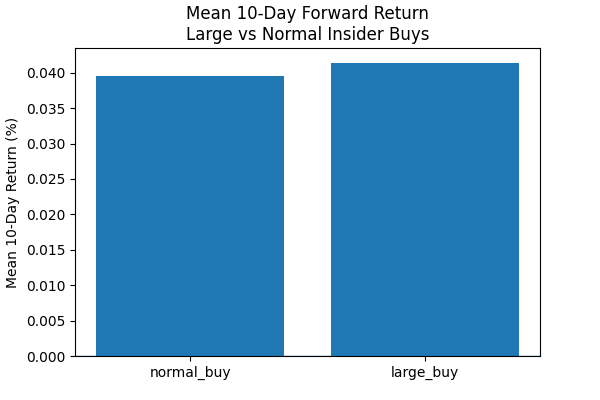
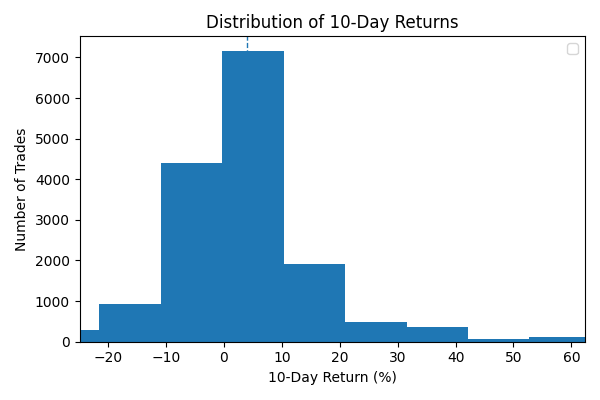
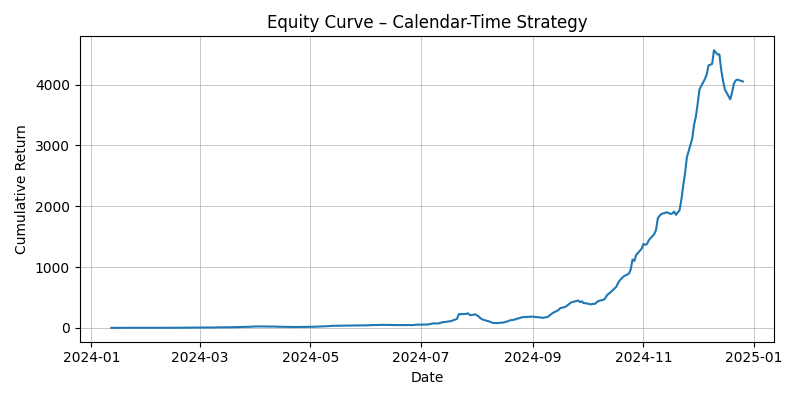

# Insider Trading Reaction Model

**A Quantitative Event-Study of Forward Returns After Insider Purchases**

Built with **Python, SQL, Yahoo Finance, and Matplotlib**

# Project Overview

This project performs a quantitative event study on open-market insider purchases (SEC Form 4 filings), measuring **10-day forward stock returns following insider buy events.**

Rather than treating all insider transactions equally, the system differentiates insider purchases by conviction size, evaluates **forward return distributions**, and constructs a **calendar-time equity curve** across a large cross-section of U.S. equities.

The goal is to assess whether insider buying behavior contains **incremental predictive information**, and how such signals behave when aggregated into a systematic trading framework.

# Methodology

The analysis follows a standard quant research pipeline:

### 1. Data Ingestion

- Load raw SEC Form 4 TSV filings across multiple quarters
- Filter for open-market insider purchase transactions
- Normalize transaction values and timestamps

### 2. Signal Construction
- Classify insider purchases into:
    - Large buys (high-conviction relative to insider’s history)
    - Normal buys
- Each transaction is treated as a discrete event

### 3. Return Calculation

- Compute 10-day forward returns from the transaction date
- Align events with historical price data from Yahoo Finance
- Aggregate returns across ~16,000 insider buy events

### 4. Portfolio Aggregation

- Construct a calendar-time equity curve
- Simulate equal-weighted exposure to active insider signals
- Track cumulative returns and drawdowns

### 5. Distributional Analysis

- Compare return distributions for large vs normal insider buys
- Analyze skewness, tails, and dispersion


# Visualizations & Interpretation

## 1. Large vs Normal Insider Buys — Mean 10-Day Forward Returns


Large Vs. Normal Insider Buys

**Interpretation:**

- Large insider buys slightly outperform normal buys on average
- Suggests insider conviction size contains incremental information
- Effect size is modest but consistent across a large sample (n ≈ 16,000)
- Supports the hypothesis that not all insider buys are equally informative

## 2. 10-Day Return Distribution



10-Day Return Distribution

**Interpretation:**

- Distribution is centered slightly above zero → insider buys are mildly bullish on average
- Right-skewed tail → a subset of insider buys capture large positive moves
- Left tail remains present → insiders are not perfect and sometimes buy ahead of declines
- Indicates insider activity is a weak but asymmetric signal

## 3. Calendar-Time Equity Curve



Calendar-Time Equity Curve

**Interpretation:**

- Equity curve shows extended flat periods followed by sharp upward moves
- Indicates **episodic, regime-dependent alpha**
- Maximum drawdown is large (≈ –67%), reflecting high volatility
- Raw insider-buy signals lack sufficient risk-adjusted performance as a standalone strategy
- Reinforces the need for **signal combination, filtering, or risk controls**

# Key Findings

- **Large insider purchases outperform normal buys**, indicates insider conviction matters.
- The **distribution of forward returns is right-skewed**, showing occasional large gains.
- A **raw insider-buy strategy is volatile** with deep drawdowns.
- Signal strength appears **regime-dependent** (some periods work extremely well).
- Insider data is likely best used as a **factor or overlay**, not a standalone model.
- These findings align with academic literature showing insider signals are most effective when combined with fundamentals, momentum, or clustering effects

## Skills Demonstrated
- Event studies & forward-return analysis
- Financial data engineering (SEC filings, market data)
- Signal evaluation & distributional analysis
- Calendar-time portfolio construction
- Python-based quantitative research pipelines

# Project Architecture

```bash
.
├── data/2024Q*/                 # Raw SEC TSV folders
├── src/
│   ├── load_raw.py              # Ingest SEC TSVs
│   ├── build_insider_table.py   # Build unified insider table
│   ├── preload_prices.py        # Download & insert price data
│   ├── quant_insider_core.py    # Core event + return logic
│   ├── run_analysis.py          # Generates results + charts
├── charts/
│   ├── large_vs_normal.png
│   ├── return_dist.png
│   ├── equity_curve.png
│   ├── results.csv
│   └── summary.csv
└── README.md
```
